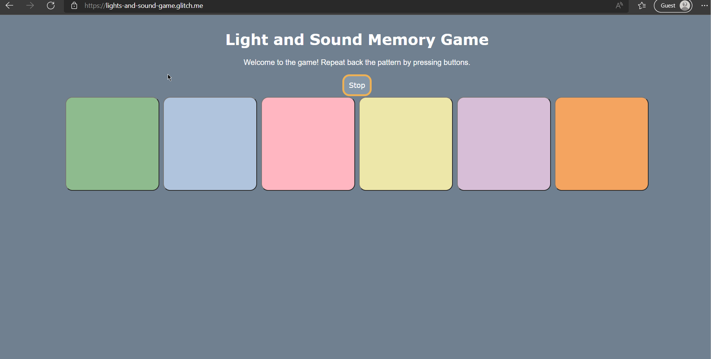

# Pre-work - *Light and Sound Memory Game*

**Light and Sound MemoryGame** is a Light & Sound Memory game to apply for CodePath's SITE Program. 

Submitted by: **Michelle Zhao**

Time spent: **18** hours spent in total

Link to project: https://lights-and-sound-game.glitch.me/

## Required Functionality

The following **required** functionality is complete:

* [x] Game interface has a heading (h1 tag), a line of body text (p tag), and four buttons that match the demo app
* [x] "Start" button toggles between "Start" and "Stop" when clicked. 
* [x] Game buttons each light up and play a sound when clicked. 
* [x] Computer plays back sequence of clues including sound and visual cue for each button
* [x] Play progresses to the next turn (the user gets the next step in the pattern) after a correct guess. 
* [x] User wins the game after guessing a complete pattern
* [x] User loses the game after an incorrect guess

The following **optional** features are implemented:

* [x] Any HTML page elements (including game buttons) has been styled differently than in the tutorial
* [x] Buttons use a pitch (frequency) other than the ones in the tutorial
* [x] More than 4 functional game buttons
* [x] Playback speeds up on each turn
* [x] Computer picks a different pattern each time the game is played
* [ ] Player only loses after 3 mistakes (instead of on the first mistake)
* [ ] Game button appearance change goes beyond color (e.g. add an image)
* [ ] Game button sound is more complex than a single tone (e.g. an audio file, a chord, a sequence of multiple tones)
* [ ] User has a limited amount of time to enter their guess on each turn

The following **additional** features are implemented:

- [ ] List anything else that you can get done to improve the app!

## Video Walkthrough (GIF)

If you recorded multiple GIFs for all the implemented features, you can add them here:

Working buttons:

Winning screen:

Losing screen:

## Reflection Questions
1. If you used any outside resources to help complete your submission (websites, books, people, etc) list them here. 
https://www.w3schools.com/css/css3_buttons.asp
https://www.smashingmagazine.com/2009/11/designing-css-buttons-techniques-and-resources/
https://www.cloudhadoop.com/javascript-random-array/

2. What was a challenge you encountered in creating this submission (be specific)? How did you overcome it? (recommended 200 - 400 words) 

When creating the Light and Sound Memory Game, I was challenged to code the final guess function to complete the logic behind the game. While I was able to put together the conditional logic of the guess function, I had to take a step back and figure out why my game didn’t display the win message. I had to do some trial and error in an attempt to find my error, such as moving the conditional statements around and ensuring that I was comparing the correct variables. I was persistent in trying to search for the issue myself, finding myself in frustration. I then paused and clearly thought about what actions I had to take, realizing that I could analyze each set of instructions to determine the issue. I thought back to what tool had helped me in numerous programming projects in the past few years: debugging. Debugging has been a lifesaver in my past projects, and learning how to properly debug has become a useful skill in my programming journey. I recollected the tip given in the pre-work documentation of using the console logging feature and decided to take advantage of it. Following each step of user input, I dissected the code step by step and line by line in order to search for the error that was causing the bug. With patience, I was able to capture how I could alter my code to completely form the logic of the game. The final challenge of creating the guess function at the end of this pre-work helped me encapsulate this memory game into this final project. While combating this situation myself and stubbornly figuring out my mistakes, I was able to learn and thoroughly understand how the variables are implemented and its behaviors within each function.

3. What questions about web development do you have after completing your submission? (recommended 100 - 300 words) 

This project opened my eyes to the world of web development and gave me a clear idea of how different coding languages can be used together in website projects. This side of programming is very foreign to me and I’ve yet to fully understand it. Given this, are there any limitations to implementing additional coding languages in the files of websites? For example, when it comes to old-school flash player games, how are additional features such as those implemented inside a website, and are there any limitations? Is this possible, and with that in mind, how do web developers in a big company collaborate with other teams of computer engineers to piece together a final project? How do web developers approach problems differently from software developers?

4. If you had a few more hours to work on this project, what would you spend them doing (for example: refactoring certain functions, adding additional features, etc). Be specific. (recommended 100 - 300 words) 

While working on this project, there were many suggestions in the pre-work documentation of “tinkering” or “playing around with the numbers” of different components as a way to make the game more customizable. If I were given more time, I would make changes to the features and styles of the game, making it more extendable. I would add more visual elements to the website that would be useful for the players of the game. This includes features such as a tally for how many lives the user has left and a working timer counting down to the milliseconds to add competitive pressure in the game. These few additional add-ons would change the player experience and could completely change the atmosphere of a game. With even more given time, I’d want to create different levels of difficulty to encourage players to advance in the game. With this, I would be able to explore the different elements and features that I could add to these websites and test if there are any limitations to the world of web development. 

## Interview Recording URL Link

[My 5-minute Interview Recording](your-link-here)

## License

    Copyright [Michelle Zhao]

    Licensed under the Apache License, Version 2.0 (the "License");
    you may not use this file except in compliance with the License.
    You may obtain a copy of the License at

        http://www.apache.org/licenses/LICENSE-2.0

    Unless required by applicable law or agreed to in writing, software
    distributed under the License is distributed on an "AS IS" BASIS,
    WITHOUT WARRANTIES OR CONDITIONS OF ANY KIND, either express or implied.
    See the License for the specific language governing permissions and
    limitations under the License.
